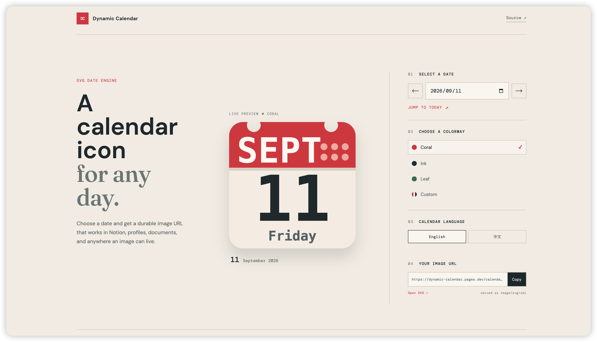

# Dynamic Calendar

[English](README.md)

> 一个可以通过 URL 指定日期的动态 SVG 日历，适用于 Notion、个人资料、文档以及任何支持图片链接的场景。

[](https://dynamic-calendar.pages.dev/)
[](https://github.com/edent/Dynamic-SVG-Calendar-Icon)

Dynamic Calendar 可以把任意日期生成干净、持久的日历图片。你可以在网页中选择日期、语言、预设主题或自定义颜色，然后复制一个可以长期使用的 URL。这个 URL 会由 Cloudflare Pages 直接返回真正的 `image/svg+xml` 图片，而不是 HTML 页面。

它适合放在各种小而实用的地方：Notion 页面图标、个人资料图片、项目文档、书签，以及任何支持远程图片 URL 的服务。

## 在线预览

**[打开 Dynamic Calendar](https://dynamic-calendar.pages.dev/)**




## 功能特点

- **自定义任意日期**：可以生成今天、历史日期或未来日期的日历图标。
- **直接返回 SVG**：图片消费者收到的是 `image/svg+xml`，不需要依赖浏览器端 JavaScript。
- **灵活的外观配置**：支持 Coral、Ink、Leaf 三种预设配色，也可以自定义顶部、底部和文字颜色。
- **中英文切换**：支持中文和英文的月份、星期、标题以及无障碍描述。
- **透明友好的 SVG**：SVG 外部背景保持透明，可以适配不同页面和应用背景。
- **实时预览工作台**：在同一个页面中选择日期、调整外观、查看预览并复制最终链接。
- **适合边缘部署**：基于 Cloudflare Pages Functions，并为日期 URL 设置了适合缓存的响应头。

## 作为图片 URL 使用

推荐使用路径格式，结构清晰，适合复制到 Notion 或其他图片消费者中：

```text
https://dynamic-calendar.pages.dev/calendar/2020/03/09.svg
```

查询参数格式适合快速测试，也可以直接通过 `date` 指定日期：

```text
https://dynamic-calendar.pages.dev/calendar.svg?date=2020-03-09
```

以上两种 URL 都会直接返回 SVG 图片，而不是网页。

### 语言切换

默认使用英文。添加 `lang=zh` 后，会显示中文月份和星期：

```text
https://dynamic-calendar.pages.dev/calendar/2020/03/09.svg?lang=zh
```

### 预设主题

使用 `theme=coral`、`theme=ink` 或 `theme=leaf` 选择预设配色：

```text
https://dynamic-calendar.pages.dev/calendar/2020/03/09.svg?theme=ink
```

### 自定义颜色

使用六位 HEX 颜色值自定义顶部、底部和文字颜色。URL 中的 `#` 需要编码为 `%23`：

```text
https://dynamic-calendar.pages.dev/calendar/2020/03/09.svg?top=%23123456&bottom=%23f4efe8&text=%2329363b
```

| 参数 | 控制内容 |
| --- | --- |
| `top` | 顶部页眉颜色 |
| `bottom` | 日历纸张颜色 |
| `text` | 日期和星期文字颜色 |
| `lang` | `en` 或 `zh` |
| `theme` | `coral`、`ink` 或 `leaf` |

在网页中选择 **Custom / 自定义** 后，系统会自动生成这些参数。

## 在 Notion 中使用

1. 打开[在线预览页面](https://dynamic-calendar.pages.dev/)。
2. 选择日期、语言和颜色。
3. 复制页面生成的图片 URL。
4. 将 URL 粘贴到 Notion 中作为图片，或设置为页面图标。

中文日历示例：

```text
https://dynamic-calendar.pages.dev/calendar/2026/09/11.svg?lang=zh&theme=coral
```

## 本地开发

```bash
npm install
npm run dev
```

本地 Vite 服务同时提供网页工作台和直接的 SVG 路由：

```text
http://localhost:5173/
http://localhost:5173/calendar.svg?date=2020-03-09
http://localhost:5173/calendar/2020/03/09.svg?lang=zh
```

项目常用命令：

```bash
npm run dev
npm run typecheck
npm run build
```

## 部署到 Cloudflare Pages

创建一个连接到此仓库的 Cloudflare Pages 项目，并使用以下设置：

| 设置 | 值 |
| --- | --- |
| 构建命令 | `npm run build` |
| 构建输出目录 | `dist` |

Cloudflare Pages 会自动识别 `functions/` 目录，不需要单独创建 Worker 项目。日期相关的 SVG 响应包含缓存头，重复请求可以在边缘节点高效处理。

## 项目结构

```text
React + Vite
    ├── 浏览器工作台和实时 SVG 预览
    ├── shared/calendar.ts SVG 与日期引擎
    └── Cloudflare Pages Function
            └── /calendar.svg 和 /calendar/YYYY/MM/DD.svg
```

React 预览、Vite 开发服务器和 Cloudflare Pages Function 共用同一个 SVG 生成器，因此网页预览和复制出来的图片 URL 会保持一致。

## 致谢

日历图标概念和最初的动态 SVG 实现基于 Edent 的 [Dynamic-SVG-Calendar-Icon](https://github.com/edent/Dynamic-SVG-Calendar-Icon)，项目遵循 MIT License。本项目在此基础上增加了可通过日期访问的 SVG 响应、自定义配色、中英文输出以及浏览器端生成工作台。

## 许可证

MIT
